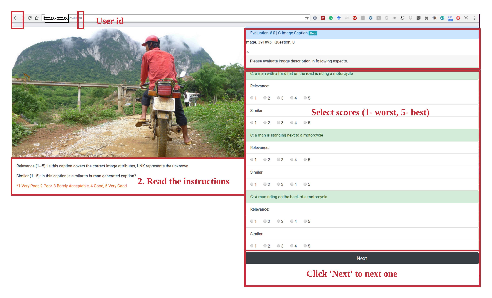

# Human evaluation tool for image captioning

## How to use
#### Enviroment
```
sudo pip install flask
```

#### Clean the history records
```
python clean.py
```


#### Start server
```
run.sh # change the ip address in run.sh
```

#### Start evalutaion on client part
##### Open web browser and start evaluation

